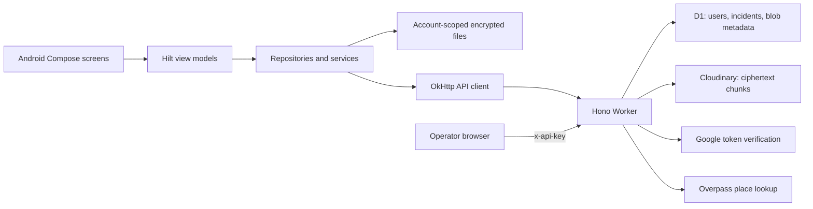

# Architecture

This describes the source in the checkout reviewed on 2026-09-26.
[Known limitations](KNOWN_LIMITATIONS.md) distinguish implemented paths from
features that are incomplete or only implied by UI text.

## Runtime boundaries

The local-device session uses encrypted local storage without cloud authentication.
Maps, geocoding, and explicitly opened external applications have their own network
behavior. The cloud flag does not act as a device-wide network switch.

## Sessions

[AuthRepository](../rakshyaa/app/src/main/java/com/rakshyaa/rakshyaa/data/auth/AuthRepository.kt)
stores session state in `SecurePreferences`. **Continue on this device** sets
the special account ID `local-device` without a bearer token. A Google session
uses Credential Manager's `GetSignInWithGoogleOption`, exchanges the resulting
ID token at `POST /auth/google`, and saves the backend JWT.

The Worker verifies Google signature, audience, issuer, and expiry through
`jose`. Its HS256 session contains a nested `user` object and `sessionVersion`.
Protected requests compare that generation with the D1 user record. Removing
and recreating an account invalidates its previous tokens.

Startup restores local login state from preferences; it does not prove a saved
cloud JWT is still valid. The active API has no refresh-token endpoint.
Sign-out stops the four manifest services and clears authentication preferences,
while retaining account files and device encryption keys.

## Persistence and backup

[EncryptedLocalStore](../rakshyaa/app/src/main/java/com/rakshyaa/rakshyaa/data/local/EncryptedLocalStore.kt)
writes under `filesDir/accounts/<SHA-256(accountId)>/encrypted_data/`.
The directory is account-scoped; the Keystore aliases are installation-scoped.

| Datastore key | Owner / content |
| --- | --- |
| `emergency_contacts` | EmergencyContactsRepository |
| `incidents` | IncidentRepository; separate plaintext reporting also occurs in cloud sessions |
| `check_ins` | CheckInRepository |
| `ride_sessions` | RideRepository and recorded waypoints |
| `safe_places` | User-added places; defaults are bundled separately |
| `legal_resources` | User-added notes; defaults are bundled separately |
| `videos` | VideoRepository metadata; encrypted media lives in per-video subdirectories |
| `location_logs` | LocationRepository; retains the latest 500 records |
| `profile_settings` | ProfileViewModel preferences |
| `profile_name`, `profile_phone`, `profile_bio`, `profile_picture_ref` | ProfileRepository cache |

List repositories serialize the whole list and call `SyncManager.saveAndSync`:
save locally first, then attempt a cloud upload if backup is enabled. Location
history, settings, and profile cache write locally directly; manual `syncAll()`
iterates all top-level datastore files, so it can also upload those keys.

`AuthViewModel` observes transitions to logged-in and calls
`AppDataSync.restoreAll()`. It lists remote **data** keys, pulls them, then
refreshes the server profile. Media bytes are fetched on demand. A downloaded
data blob must decrypt successfully before replacing its local copy.

Keep this orchestration outside `AuthRepository`: adding a dependency on
`AppDataSync` produces the Hilt cycle through `ProfileRepository`.

Backup preference gates uploads; current restore reads do not check that setting.
There is no durable upload queue, conflict resolution, or cross-device key recovery.
Manual sync uploads datastore files, not every locally saved video.

## Foreground and helper services

Only these four classes are manifest services:

| Service | Manifest type | Responsibility |
| --- | --- | --- |
| SOSActivationService | `location\|shortService` | Runtime SOS state, initial incident, periodic last-known location logging |
| LocationTrackingService | `location` | GPS callbacks, requested at 5 minutes / 100 metres |
| RideMonitoringService | `location` | Ride session GPS points, requested at 10 seconds / 5 metres |
| CheckInService | `specialUse` | In-process check-in timer and local notifications |

These use `@AndroidEntryPoint` plus injected fields. The six helper classes
VideoEncryptionService, EmergencyContactsService, FakeCallService, LegalHelpService,
SafePlacesService, and GeocodingService use singleton constructor injection.
A helper named “Service” is not necessarily an Android `Service`.

GPS intervals are request parameters, not delivery guarantees. Timer state and
active ride/SOS state are not a persisted restart protocol.

## Cloud data

The [D1 migration](../backend/migrations/0001_initial.sql) creates four tables:

- `users`: Google subject, account generation, profile fields, creation time.
- `blobs`: user-scoped key, kind, byte size, ciphertext checksum, timestamps.
- `blob_parts`: ordered Cloudinary object references and sizes.
- `incidents`: owner, active/resolved status, coordinates, activation/creation times.

User deletion cascades through relational records. Blob deletion cascades through
parts. Cloudinary cleanup is handled explicitly before account or blob deletion.

Cloudinary objects use hashed user/key prefixes, a random upload generation, and
8 MiB chunks. D1 stores the ordered part references. Replacement schedules old-part
cleanup in the execution context; external storage and D1 do not share a transaction.

## Incident reporting and operators

SOS creates a local incident UUID, then attempts to post that same UUID to the
Worker for cloud sessions. Replaying an owned UUID is idempotent. Resolution is
also best-effort from Android.

The operator portal uses a shared API key and manual HTTP refresh. It displays
the latest 50 active records, with initial incident coordinates. Periodic local
SOS location logging does not update those plaintext incident coordinates.
There is no dispatch, SMS gateway, acknowledgement, or real-time subscription.

## Nearby places and profile photos

The Worker queries Overpass within 50 km for hospitals, clinics/doctors, police,
and fire stations, then sorts and returns at most 25 places. Android applies its
selected radius and merges user-added places. Failed/unavailable lookup uses
bundled sample places and saved entries.

Uploaded profile photos use encrypted media ID `profile-picture` and
`picture = "media:profile-picture"`. ProfileRepository downloads/decrypts them to
a cache file for display. Google URL avatars use the URL path. Google sign-in
updates server name, email, and picture, while preserving phone and bio.
