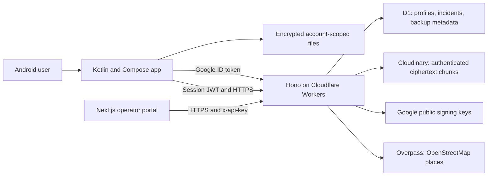

# Technology inventory

This inventory describes the active implementation reviewed on 2026-09-27.
Versions below are declarations in the build manifests, not claims about the
latest releases. npm caret ranges can resolve to newer versions in lockfiles;
use `npm ci` to reproduce the checked-in dependency selection.

## System overview

Local sessions do not need a backend. Cloud profiles and incident coordinates
are server-readable; encrypted file backups remain ciphertext. Keystore keys
stay with the app installation and cannot be recovered from a cloud backup.

## Android toolchain and language

Sources: [project build](../rakshyaa/build.gradle),
[app build](../rakshyaa/app/build.gradle), and
[Gradle wrapper](../rakshyaa/gradle/wrapper/gradle-wrapper.properties).

| Technology | Declared version / setting | Responsibility |
| --- | --- | --- |
| Kotlin + Kotlin Compose/serialization plugins | 2.0.20 | App language and compiler plugins |
| JDK / JVM target | 17 | Build toolchain and bytecode target |
| Gradle wrapper | 8.11.1 | Reproducible Android build entry point |
| Android Gradle Plugin | 8.10.1 | Android compilation, variants, packaging, lint |
| Android SDK | min 24; compile/target 36 | Device floor and SDK APIs |
| Kotlin kapt | Kotlin plugin | Hilt annotation processing |
| APK / Android App Bundle | Release outputs | Direct installation / store distribution |
| keytool, apksigner, zipalign, ADB | JDK / Android SDK tools | Key management, artifact verification, device install |

Application ID and namespace are `com.rakshyaa.rakshyaa`. Current app version
declarations are name `1.1` and code `2`.

## Android application libraries

| Library / platform | Declared version | Use |
| --- | --- | --- |
| AndroidX Core KTX | 1.13.1 | Kotlin Android helpers |
| Activity Compose | 1.9.1 | Compose activity integration |
| Lifecycle runtime, ViewModel, runtime-compose | 2.8.4 | Lifecycle-aware state and view models |
| Compose BOM | 2024.08.00 | Version alignment for UI dependencies |
| Compose UI, foundation, Material 3, material icons | BOM-managed | Screens, layout, UI components and icons |
| Compose animation / animation-core | 1.6.8 | Explicit animation dependencies |
| Navigation Compose | 2.7.7 | Screen navigation |
| Dagger Hilt | 2.52 | Dependency injection |
| Hilt Navigation Compose | 1.2.0 | Injected view models in navigation |
| AndroidX Security Crypto | 1.1.0-alpha06 | Encrypted authentication preferences |
| Android Keystore + AES-256-GCM | Android platform | Installation-bound keys and authenticated encryption |
| Credential Manager + Play services auth bridge | 1.3.0 | Google credential retrieval |
| Google ID library | 1.1.1 | Google sign-in options/token handling |
| Google Play services location | 21.3.0 | Current-location integration |
| OkHttp | 4.12.0 | HTTP API requests |
| kotlinx.serialization JSON | 1.6.3 | Model serialization |
| Auth0 java-jwt | 4.4.0 | Client session JWT parsing; server performs verification |
| kotlinx.coroutines Android | 1.8.1 | Asynchronous work |
| CameraX core/camera2/lifecycle/view/video | 1.4.2 | Video capture |
| Coil Compose | 2.7.0 | Profile image loading |
| osmdroid Android / WMS | 6.1.15 | OpenStreetMap-based maps |
| Android foreground services and notifications | Android platform | Active SOS, tracking, ride and check-in work |
| Android intents / geocoding facilities | Android platform | SMS composition, dialer, map links, place descriptions |

Persistence uses account-scoped encrypted serialized files and preferences, not
Room. Camera recording and decrypted playback can temporarily use plaintext
private-cache files. Four classes are manifest services; helper classes named
`Service` are not all Android service components. See
[architecture](ARCHITECTURE.md) and [security](SECURITY.md).

## Backend runtime and development dependencies

Source: [backend/package.json](../backend/package.json). Exact npm resolutions
are recorded in [backend/package-lock.json](../backend/package-lock.json).

| Technology | Declared version / setting | Responsibility |
| --- | --- | --- |
| TypeScript | ^5.9.2 | Active Worker and tests; strict typechecking |
| Cloudflare Workers | compatibility date 2026-09-26; `nodejs_compat` | Hosted request execution |
| Hono | ^4.9.8 | Routing, middleware, CORS, security headers |
| jose | ^6.1.0 | Google RS256 validation and HS256 session signing |
| Cloudflare D1 / SQLite SQL | `DB` binding | Users, incidents, blob metadata and part references |
| Wrangler | ^4.40.2; installed 4.141.0 at review | Local runtime, secrets, D1 migrations, deployment |
| Node.js and npm | installed Wrangler requires Node >=22 | Development tools; not a persistent production Node server |
| Web Fetch, Streams, Web Crypto | Worker runtime APIs | Upstream calls, downloads, signatures/checksums |
| Cloudinary HTTP APIs | No Cloudinary SDK dependency | Authenticated raw-object upload/download/deletion |
| Vitest | ^4.1.0 | Worker regression tests |
| Cloudflare Vitest plugin | ^1.0.0 | Worker-runtime test integration |
| MSW / @msw/cloudflare | ^2.14.0 / ^0.1.0 | External HTTP mocking in tests |
| @types/node | ^26.6.3 | Development type declarations |

The four D1 tables are `users`, `blobs`, `blob_parts`, and `incidents`. Schema
changes are SQL migrations. Uploads are capped at 50 MiB and split into 8 MiB
Cloudinary chunks; the incoming upload is buffered before splitting.

## Operator portal

Source: [admin/package.json](../admin/package.json). Exact versions are in
[admin/package-lock.json](../admin/package-lock.json).

| Technology | Declared version | Responsibility |
| --- | --- | --- |
| Next.js | ^16.3.1 | Pages Router app, development server and production build |
| React / React DOM | ^19.2.8 | UI and in-memory state |
| TypeScript | ^7.0.2 | Portal source typechecking |
| @types/react / @types/node | ^19.2.18 / ^26.2.0 | Development type declarations |
| CSS | Local stylesheets | Portal styling |
| Browser Fetch / AbortSignal | Browser APIs | Manual incident requests with a 15-second timeout |

The portal uses manual refresh and a shared operator key held in memory. It is
not a real-time dispatch system and supplies no per-operator roles. There is no
portal test or lint npm script. `next-env.d.ts` is generated by Next.js tooling.

## Testing and validation

Android declares JUnit 4.13.2, Mockito 5.12.0, Truth 1.4.2,
coroutines-test 1.8.1, AndroidX Test Core 1.6.1, Robolectric 4.13,
AndroidX JUnit 1.2.1, Espresso 3.7.0, and Compose UI tests/tooling.
JVM tests, instrumentation, Android Lint, physical-device tests, backend Vitest,
TypeScript checks, and the portal build cover different failure modes. See
[testing](TESTING.md) for commands and evidence requirements.

## External services and data recipients

| Service | Data/function |
| --- | --- |
| Google Identity | Optional account sign-in and token verification |
| Cloudflare Workers / D1 | API handling, profiles, incidents, backup metadata |
| Cloudinary | Ciphertext chunks and storage object metadata |
| OpenStreetMap / Overpass | Map/place data; nearby requests include coordinates |
| Device geocoding and external map/SMS/dialer apps | Separate network behavior and user-initiated actions |
| GitHub, when published | Source hosting and optional release assets; not the API runtime |

Express, filesystem SQLite, the old Docker recipe, and Node regression files are
historical artifacts. Supabase is not an active integration. There is no active
SMS gateway, push-based operator feed, or cross-device key-recovery service.

This is a direct-dependency and architecture inventory, not a complete transitive
SBOM or license audit. Preserve lockfiles and inspect resolved dependencies for
release audits. Android includes MIT text, backend declares MIT, and admin
declares ISC; reconcile licensing before publishing a unified license claim.
